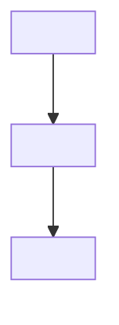
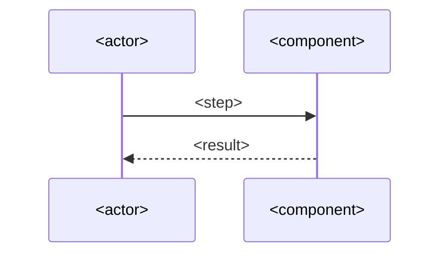

## Overview

<2–3 short paragraphs: the current state, the problem (why it matters / the risk), and one
sentence on what this design adds. No implementation detail.>

**References:**
- [<PARENT/CONTEXT-TICKET> — <name>](url)   <!-- only historical/parent/context tickets -->

---

## Summary

| | |
|---|---|
| **What** | <one line> |
| **Why** | <one line> |
| **Where it runs** | <component / orchestrator> |
| **Trigger** | <cron / event> |
| **Human touchpoint** | <where a human reviews/approves> |
| **Key invariants** | <the 2–4 things that must always hold> |

---

## Scope

**In scope**
- <component / capability>
- <component / capability>

**Out of scope**
- <thing> — <one-line reason or "see Decision N">
<!-- bullets, not paragraphs. Do not list everything you won't do — only the few a reader
     would reasonably expect to be in scope but isn't. -->

---

## Decisions

### 1. <Question this decision answers?>

**<Bold one-line decision.>**

<1–3 sentences of rationale. State the tradeoff. If a rejected alternative was genuinely
close: "Chose X over Y because…". Otherwise don't mention alternatives.>

### 2. <Question?>

**<Decision.>**

<Rationale.>

<!-- Add a `### N.` per real decision. Branching behavior → use a decision matrix table: -->

| Case | Behavior |
|---|---|
| <case> | <what happens> |

---

## Architecture

### Component Overview



### Execution Flow



### Sample Artifact

<!-- Show one real example (YAML/JSON/SQL) instead of describing its shape in prose. -->

```yaml
# <path>
<key>: <value>
```

---

## Dependencies

| Dependency | Purpose |
|---|---|
| `<repo/service>` | <one line> |
| <credential/secret> | <one line — point to Security for detail, don't inline the runbook> |

---

## Resilience

- [x] **<failure mode>** — <how the design detects/recovers, one line>
- [x] **<failure mode>** — <one line>

---

## Security

- [x] <control, one line>
- [x] <control, one line>

---

## Effort Estimate

| Component | Days | SP |
|---|---|---|
| <component> | <Nd> | <N> |
| **Total** | **<N>d** | **<N> SP** |
